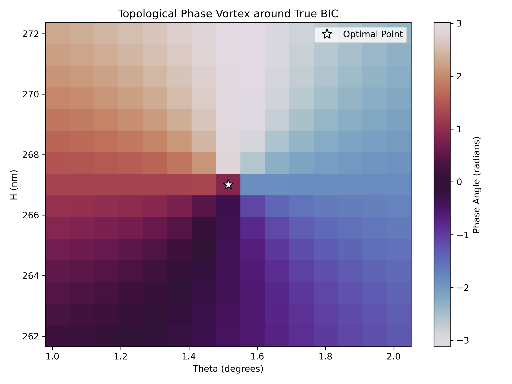
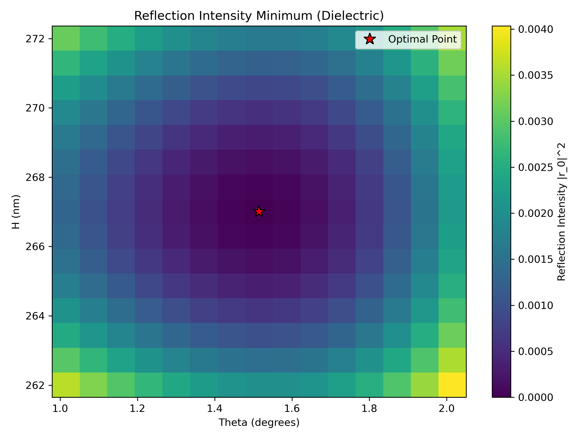

# BICxRCWA

**Modeling a Bound State in the Continuum (BIC) using a Coordinate-transformed Rigorous Coupled-Wave Analysis (C-RCWA) solver.**

This project implements a photonics simulation pipeline to find and visualize a Bound State in the Continuum embedded in a dielectric grating structure. The solver is written in Python (originally ported from a MATLAB implementation by Dr. Benjamin Civiletti) and combines analytical electromagnetic theory, numerical optimization, and physics-based animation.

---

## Table of Contents

- [Background](#background)
- [Physics](#physics)
  - [Bound States in the Continuum (BIC)](#bound-states-in-the-continuum-bic)
  - [C-RCWA Method](#c-rcwa-method)
  - [Structure Geometry](#structure-geometry)
- [Repository Structure](#repository-structure)
- [Installation](#installation)
- [Usage](#usage)
  - [Finding the BIC (rcwa_v2.py)](#finding-the-bic-rcwa_v2py)
  - [Generating Animations (bic_animation_2.py)](#generating-animations-bic_animation_2py)
- [Results](#results)
  - [BIC Parameters](#bic-parameters)
  - [Phase Vortex and Topological Charge](#phase-vortex-and-topological-charge)
  - [Wave Propagation Animations](#wave-propagation-animations)
- [Code Reference](#code-reference)
  - [rcwa_v2.py](#rcwa_v2py-1)
  - [bic_animation_2.py](#bic_animation_2py-1)
- [Authors](#authors)

---

## Background

A **Bound State in the Continuum (BIC)** is a counterintuitive resonance phenomenon where a wave state remains perfectly localized — with zero radiation leakage — even though it exists within the energy spectrum of freely propagating (continuum) modes. In photonics, BICs appear in periodic structures such as diffraction gratings and photonic crystals as dark modes with theoretically infinite quality factor (Q → ∞).

This project numerically demonstrates a symmetry-protected / accidental BIC in a **1D dielectric grating** using the C-RCWA electromagnetic solver. The BIC manifests as a complete zero in the far-field reflection spectrum and is topologically protected — the complex reflection coefficient winds around the origin in parameter space, giving the BIC a quantized topological charge of **q = −1**.

---

## Physics

### Bound States in the Continuum (BIC)

For a normally-incident or obliquely-incident plane wave on a grating, the specular (zeroth-order) complex reflection amplitude `r₀(θ, H)` depends on the incidence angle `θ` and the grating height `H`. A **true BIC** is the special parameter point `(θ*, H*)` where:

```
|r₀(θ*, H*)| = 0
```

At this point the incoming wave passes through the structure without any reflected power — it is perfectly transmitted because the resonant mode of the grating is decoupled from the radiation continuum. Encircling this zero in parameter space reveals a **topological phase vortex** with winding number `q = −1`, confirming the topological nature of the state.

### C-RCWA Method

The **Coordinate-transformed Rigorous Coupled-Wave Analysis (C-RCWA)** handles the curved grating boundary analytically by applying a smooth coordinate transformation that maps the physical domain (with a bumpy grating surface) into a rectangular computational domain. The transformation is:

- **Grating profile:** `g(x) = 50 · exp(−(x/50)²)` nm (Gaussian bump)
- **Coordinate map S(y):** `S(y) = ½(1 + cos(π/H · (y − H)))` — a smooth cosine ramp that stretches/compresses the vertical coordinate to absorb the surface.
- **Metric tensor components** (`a₁₁, a₁₂, a₂₁, a₂₂`) are derived from the Jacobian of the transformation and appear explicitly in Maxwell's equations inside the grating layer.

At each y-slice, the electric and magnetic permittivity tensors are expanded into **Toeplitz Fourier coefficient matrices** (via a custom Simpson-integrated FFT), and the field eigenmodes are propagated using matrix exponentials. Boundary conditions are assembled via a **reflection-kernel** (Zs) recursion to obtain the scattering matrix.

The method retains full coupling between all Fourier modes and is therefore rigorous — not a perturbative or approximate technique.

### Structure Geometry

```
 ┌───────────────────────────────┐
 │       DIELECTRIC  (ε = 12)    │  thickness = 700 nm
 │                               │
 ├─────── GRATING INTERFACE ─────┤  Gaussian bump profile
 │          AIR  (ε ≈ 1)         │  height H ≈ 267 nm
 │                               │
 │  →→→  plane wave (p-pol) →→→  │
 └───────────────────────────────┘
```

| Parameter | Value |
|---|---|
| Wavelength λ₀ | 600 nm |
| Grating period Λ | 500 nm |
| Grating bump amplitude | 50 nm |
| Grating bump width (σ) | 50 nm |
| Dielectric permittivity | 12.0 (silicon-like) |
| Air permittivity | ~1 (1 + i·10⁻⁹) |
| Polarization | p (TM) |
| Number of Fourier modes (±N) | ±5 (11 total) |

---

## Repository Structure

```
BICxRCWA/
├── rcwa_v2.py                   # Main C-RCWA solver + BIC optimization pipeline
├── bic_animation_2.py           # Time-dependent wave propagation animation
├── BIC_wave_propagation_1.gif   # Animation: full structure (air + dielectric)
├── BIC_wave_propagation_2.gif   # Animation: alternate view
├── BIC_wave_propagation_air.gif # Animation: air region only (OFF-BIC vs BIC)
├── phase_vortex_dielectric.png  # 2D phase map showing topological vortex
└── intensity_crater_dielectric.png # 2D intensity map showing the BIC minimum
```

---

## Installation

**Python 3.8+** is required. Install dependencies with pip:

```bash
pip install numpy scipy matplotlib
```

No additional packages are needed. The code uses only the Python standard library plus NumPy, SciPy, and Matplotlib.

---

## Usage

### Finding the BIC (`rcwa_v2.py`)

The main script provides several modes of operation, controlled via the `if __name__ == "__main__":` block at the bottom of the file.

#### Full overnight pipeline (recommended for new structures)

```python
run_overnight_bic_hunt()
```

Runs a complete automated 3-stage pipeline:

1. **Stage 1 — 2D Coarse Grid Scout:** Evaluates `|r₀|²` on a 20×20 grid over `θ ∈ [0°, 15°]` and `H ∈ [300, 800]` nm. Saves `stage1_2D_scout.png`.
2. **Stage 2 — Fano Ridge Detection:** Computes the gradient of the intensity map to locate the Fano resonance ridge (the region of steep phase variation adjacent to the BIC). Seeds the optimizer just downhill of the ridge.
3. **Stage 3 — Nelder-Mead Optimization:** Drives `|r₀|²` to a true zero using `scipy.optimize.minimize`. Saves the optimum to `bic_optimization_results.txt`.
4. **Stage 4 — Phase & Intensity Maps:** Generates a zoomed 15×15 grid around the optimum to produce `phase_vortex_dielectric.png` and `intensity_crater_dielectric.png`, and computes the topological winding number.

> ⚠️ **Runtime warning:** The full pipeline can take several hours to complete depending on hardware. The 15×15 phase map alone takes ~75 minutes on a single CPU core.

#### Run the optimization only (if you already know a good starting guess)

```python
run_optimization()
```

Starts Nelder-Mead from `x0 = [8.5714°, 447.37 nm]` and drives to the minimum. Adjust `x0` for a different structure.

#### Interactive two-stage parameter sweep

```python
run_two_stage_sweeps()
```

1. Sweeps `θ` at fixed `H = 700 nm` and plots the result.
2. Asks for user input to select a `θ`, then sweeps `H` at that fixed angle.

#### Generate phase and intensity maps around the known BIC

```python
optimal_theta = 1.51490625   # degrees
optimal_H     = 267.00795001  # nm
plot_phase_vortex(optimal_theta, optimal_H)
```

Generates the two diagnostic plots in ~75 minutes without re-running the full optimizer.

---

### Generating Animations (`bic_animation_2.py`)

Run the script directly:

```bash
python bic_animation_2.py
```

The script:
1. Calls the embedded RCWA solver to compute the **complex** time-harmonic field `H_y(x, y)` for two cases:
   - **OFF-BIC:** `θ = 8.57°` — strong specular reflection visible.
   - **BIC:** `θ = 1.5149°` — essentially zero reflection.
2. Constructs the physical time-dependent field `Re[H_y(r) · e^{−iωt}]` at 48 uniformly-spaced phase snapshots over one optical period.
3. Renders a side-by-side animation and saves it as `BIC_wave_propagation_air.gif` (air region only) and optionally as an `.mp4` if FFmpeg is available.

> **Note:** The coordinate convention in the animation is intentionally flipped — the plane wave propagates upward from the air region into the dielectric grating. This is a sign/direction convention only and does not affect the physics.

---

## Results

### BIC Parameters

The Nelder-Mead optimizer converges to:

| Parameter | Value |
|---|---|
| Incidence angle θ* | **1.51490625°** |
| Layer height H* | **267.00795001 nm** |
| Reflection intensity `\|r₀\|²` | ~10⁻⁸ (numerically zero) |

### Phase Vortex and Topological Charge

The figure `phase_vortex_dielectric.png` shows the complex phase angle `∠r₀(θ, H)` on a 15×15 grid centred on the BIC. The phase winds by `−2π` as you encircle the BIC in parameter space, confirming a **topological winding number q = −1**.



The figure `intensity_crater_dielectric.png` shows the corresponding intensity `|r₀|²`, with a sharp crater-like dip at the BIC point.



### Wave Propagation Animations

The animations compare the field `Re[H_y · e^{−iωt}]` in the air region for an off-resonance angle (left) and the BIC angle (right):

- **OFF-BIC (left):** Clear standing-wave pattern caused by the interference of the incident and strongly reflected wave.
- **BIC (right):** No reflected wave — the oscillating field propagates cleanly upward into the grating with essentially no return signal.


---

## Code Reference

### `rcwa_v2.py`

| Symbol | Description |
|---|---|
| `gridC(...)` | Builds the spatial x/y grid and layer boundary array |
| `create_Y_matrix(...)` | Assembles the 2×2 block admittance matrix Y |
| `simpson(f, left, right, numSub)` | Simpson's rule integration (callable or array input) |
| `bisection(f, left, right, TOL)` | Root-finding by bisection |
| `ToeplitzM(m, f, L, sampleP)` | Constructs the `m × m` Toeplitz matrix of Fourier coefficients of `f` |
| `get_reflection(theta_inc, H_val, p_pol)` | Core C-RCWA engine: returns the complex zeroth-order reflection coefficient `r₀` |
| `objective_function([theta_deg, H_val])` | Wraps `get_reflection` to return the real scalar `\|r₀\|²` for the optimizer |
| `run_two_stage_sweeps()` | Interactive 1D parameter sweeps (θ then H) |
| `run_optimization()` | Single Nelder-Mead run from a given starting point |
| `plot_phase_vortex(theta_c, H_c)` | 2D phase/intensity maps + topological winding number calculation |
| `calculate_winding_number(phase_grid)` | Contour integral of the phase gradient to extract the integer winding number |
| `run_overnight_bic_hunt()` | Full automated pipeline: scout → Fano ridge detection → optimization → phase maps |

### `bic_animation_2.py`

Contains the same embedded RCWA solver functions (`gridC`, `ToeplitzM`, `create_Y_matrix`, `simpson`) plus:

| Symbol | Description |
|---|---|
| `solve_complex_field(theta_rad)` | Runs the C-RCWA solver and returns the full 2D complex field `H_y(x, y)` |
| `update(frame)` | Matplotlib animation callback — advances the time phase `ωt` |

---

## Authors

- **MATLAB original:** Dr. Benjamin Civiletti
- **Python port & extension:** Hoang Trieu
- First ported: June 6, 2024 — Last updated: May 2, 2026
